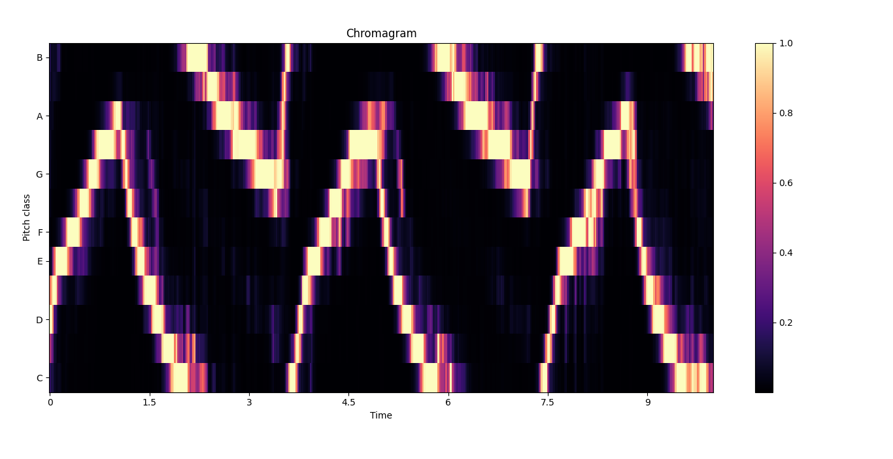

# emergency-vehicles-detection
This Deep Learning project is develop to detect emergency vehicles (ambulance, police cars, ...) using street audio. CNN and chroma features will help us achieve this goal.

# Demostration
To test this model, dowload backend folder and in that directory run: pip install -r requirements.txt

Then run: python api.py

It will take a few seconds, but you will start seeing in the terminal the detection of the model in real time.
You can also use this simple website I created to see what the model is detecting: https://evd-frontend.netlify.app

You can now try to reproduce sounds next to your computer like ambulance sirens, but also other sounds, and see what the model detects.

Have fun!

# Project Description

## Getting data
We will use this dataset for our purposes: https://research.google.com/audioset/dataset/index.html
This dataset give us Youtube urls to vides about different noises, like helicopters, wind, car engines, traffic noise, ... and of course emergency vehicle noises.

We will create a Python program to dowload each emergency vehicle video, get just the clip we want (the dataset give us start and finish time of the clip), and get rid of the image part, since we are only going to work with audio. We ended up with 9000 audios between positive and negative ones.

Then, we will use those relevant classes in the dataset, like those mentioned before (we are not going to train this CNN with pig noises, but they are in the dataset anyways), to have 50% of emergency vehicle audios and 50% of anything else.

## Preprocessing
Some clips are 3 seconds long, an others 10 seconds long, so we need to adapt them to have the same duration. Since most of them are 10 seconds long, we will adapt them all to this duration. We will also normalize this audio values.

Now, as we are going to work with CNN, we are going to convert those audio files into images, by extrating their chroma features.
Chroma features are the relevance of each musical pitch (A to G or Do to Si depending on the country) in a specific moment of the audio. Let's see two examples:

The first one is an idle engine, so same frequency over time. The second one is a girl singing, so different pitches.

These images is what we are going to use to train or CNN model.

## Methodology
We start showing the arquitecture created for the CNN model.

- Input Layer:
input_shape: This parameter defines the dimensions of the input data. The provided code assumes your input data has an unspecified height (input_shape[0]), width (input_shape[1]), and a single channel (input_shape[2]).

- Convolutional Layer 1:
Conv2D(32, kernel_size=(3, 3), strides=1, activation='relu'):
This layer applies 32 filters of size 3x3 with a stride of 1 to the input. Stride of 1 means the filters slide one pixel at a time across the input.
The relu (Rectified Linear Unit) activation function introduces non-linearity, helping the network learn complex patterns.

- Pooling Layer 1:
MaxPooling2D(pool_size=(2, 2), strides=2):
This layer performs down-sampling by applying a 2x2 max pooling operation with a stride of 2. This reduces the spatial dimensionality of the data, making it computationally more efficient and helping the network focus on relevant features.

- Convolutional Layer 2:
Conv2D(64, kernel_size=(3, 3), strides=1, activation='relu'):
Similar to the first convolutional layer, but with 64 filters, potentially capturing more intricate features.

- Pooling Layer 2:
MaxPooling2D(pool_size=(2, 2), strides=2):
Another 2x2 max pooling operation with a stride of 2 for further down-sampling.

- Flattening Layer:
Flatten():
This layer transforms the 2D feature maps from the previous convolutional layers into a 1D vector, suitable for feeding into fully connected layers.

- Fully Connected Layer 1:
Dense(128, activation='relu'):
This layer is the first fully connected layer with 128 neurons. It connects all neurons from the flattened layer to each neuron in this layer, allowing the network to learn more complex relationships between features. The relu activation provides non-linearity.

- Dropout Layer:
Dropout(0.2):
This layer randomly drops 20% of the neurons during training, helping to prevent overfitting by reducing the reliance on any specific neuron.

- Output Layer:
Dense(2, activation='softmax'):
The final layer has 2 neurons with a softmax activation function. Softmax ensures the output values sum to 1, representing probabilities for two possible classes.

We split the dataset with 70% (6300 images) to train, 10% (900 images) to validate and 20% (1800 images) to test.

## Results and conclusion
Here you can see an ambulance audio correctly classified, this kind of sounds are really different from the others:

We achieve a 93.95% of accuracy showing the potencial of CNNs when comes to image classification.

